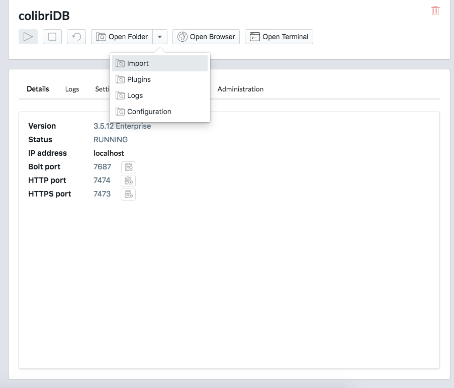

# Datasets
Datasets creados para poblar la base de datos en Neo4j
[Más Info](https://neo4j.com/docs/cypher-manual/current/clauses/load-csv/)

## DatasetsCreator.py
Datasets creator es un programa para crear automaticamente todos archivos *.csv* listos para importarse

1. Instalar paquetes: `pip3 install -r requirements.tx`
2. Ejecutar programa: `python3 DatasetsCreator.py`

Los archivos se generaran automanticamente en el directorio dónde se ejecuta el programa

## Importar datasets (local)
Colocar los *.csv* dentro de la carpeta *import* de Neo4j, puedes encontrarla facilmente dentro de la aplicación *Neo4j Desktop*: 

### Importar todo con .cypher

### Importación individual
Despues de tener todos los  *.csv* dentro de la carpeta import hay que ejecutar los siguientes comandos

#### Constrains para los usuarios
- `CREATE CONSTRAINT ON (user:User) ASSERT user.id IS UNIQUE;`
- `CREATE CONSTRAINT ON (user:User) ASSERT user.username IS UNIQUE;`
- `CREATE CONSTRAINT ON (user:User) ASSERT user.mail IS UNIQUE;`

#### Importar Users
- `LOAD CSV WITH HEADERS FROM 'file:///UserCSV.csv' AS line CREATE (:User {username:line.username,password:line.password,mail:line.mail,created_at:datetime(line.created_at),verified:line.verified})`

#### Importar Posts
- `LOAD CSV WITH HEADERS FROM 'file:///PostsCSV.csv' AS line CREATE (:Post {id:line.id, text:line.text, created_at:datetime(line.created_at)})`

#### Importar Relación CREATED (User -> Post)
- 

#### Importar Relación FOLLOWS (User -> User)
- 

#### Importar Relación LIKES (User -> Post)
- 
